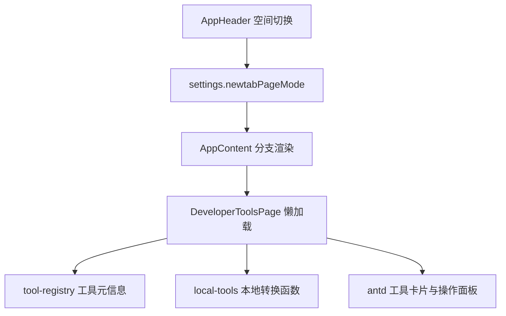

## User Requirements

在当前新标签页中，在“热榜”后面新增一个“开发工具栏”入口，参考 Chrome 扩展“开发工具箱”和“常用工具 ToolBox”的功能组织方式，形成面向开发者的常用工具集合页。

## Product Overview

新增的“开发工具栏”作为独立一级空间展示，位于顶部空间切换中的“热榜”之后。页面以工具箱形式呈现，帮助用户快速完成日常开发中的文本转换、数据格式化、时间转换、编码解码、哈希摘要、进制转换、随机生成和颜色查看等操作。

视觉上延续现有新标签页的毛玻璃卡片、柔和阴影、圆角、轻量动效和响应式网格风格，保持与“热榜”页面一致的高级感与信息密度。

## Core Features

- 在“工作台 / 鱼塘 / 热榜”后新增“开发工具栏”一级入口。
- 提供高频本地工具：JSON 格式化与压缩、URL 编码解码、Base64 编码解码、Unix 时间戳转换、哈希摘要、进制转换、随机数与 UUID 生成、颜色值预览。
- 支持按分类浏览、关键词搜索工具、点击工具卡片打开对应操作面板。
- 每个工具提供输入区、输出区、错误提示和一键复制能力。
- 默认本地处理用户输入；二维码、DNS、WHOIS、翻译等涉及网络的工具可作为后续增强，并需明确提示隐私边界。

## Tech Stack Selection

- 前端框架：沿用现有 React 19 + TypeScript。
- UI 组件：沿用现有 antd 6 组件体系，复用 `Card`、`Segmented`、`Input`、`Button`、`Tooltip`、`Alert`、`Typography` 等模式。
- 图标：沿用现有 `lucide-react`。
- 状态与设置：沿用 `zustand` settings store，`newtabPageMode` 作为一级空间切换状态。
- 构建与验证：沿用 Vite、TypeScript、ESLint、Vitest；可通过 `pnpm build`、`pnpm lint`、`pnpm test` 验证。
- 依赖策略：首版不新增第三方依赖，优先使用浏览器 Web API 与项目已有依赖，降低包体与权限风险。

## Implementation Approach

本方案将“开发工具栏”作为新的一级页面模式接入现有新标签页结构：扩展 `NewtabPageMode`，在 `AppHeader` 的空间切换中把新入口放到“热榜”之后，并通过懒加载渲染新的 `DeveloperToolsPage`。

功能实现采用“工具注册表 + 纯函数转换工具 + 页面容器”的分层方式：

- 工具注册表负责工具分类、名称、别名、描述、图标、是否本地处理等元信息。
- 本地工具函数负责 JSON、URL、Base64、时间戳、哈希、进制、随机生成、颜色解析等转换逻辑。
- 页面组件负责搜索、分类过滤、卡片网格、工具面板、复制和错误展示。

关键决策：

- 首版只实现本地工具，避免新增网络权限和敏感输入外传风险。
- 通过 lazy import 接入新页面，避免影响工作台与热榜首屏加载。
- 不改动热榜数据服务、Service Worker 缓存逻辑和现有标签整理功能，控制变更范围。
- 哈希摘要优先使用 Web Crypto 提供 SHA-256；MD5 若后续必须支持，再评估轻量可信实现或受控依赖，避免为了单一工具增加不必要包体。
- JSON 解析、Base64 解码等失败时返回明确错误，不抛出未捕获异常。

## Performance and Reliability

- 工具搜索在前端本地完成，工具数量有限，复杂度为 O(n)，使用 `useMemo` 避免无关渲染重复计算。
- 文本转换复杂度与输入长度线性相关；JSON 格式化、压缩使用原生 `JSON.parse` 和 `JSON.stringify`，大输入需显示错误或提示，避免页面卡顿。
- 自动转换应控制触发频率；复杂转换可在用户点击按钮后执行，避免每次输入都重算。
- 复制使用 Clipboard API，并提供失败提示；不记录用户输入内容，避免隐私风险。
- 保持 `settings.newtabPageMode` 向后兼容：旧用户没有该值时仍默认 `workspace`。

## Architecture Design

当前已确认的接入链路：

- `src/pages/newtab/App.tsx` 已懒加载 `TrendingPage`，顶部 `Segmented` 当前包含 `workspace / fishpond / trending`。
- `src/shared/types.ts` 中 `NewtabPageMode` 当前为 `'workspace' | 'fishpond' | 'trending'`。
- `src/shared/i18n/zh-CN.ts` 与 `src/shared/i18n/en.ts` 已有 `pageMode.*` 与 `trending.*` 文案区域。
- `src/features/trending/TrendingPage.tsx` 提供了可复用的页面结构参考：标题卡、分类 `Segmented`、毛玻璃卡片网格、操作按钮和局部状态管理。

推荐结构：



## Implementation Notes

- 所有新增注释遵守项目约定：使用标准 TSDoc，且注释为中文。
- 新页面优先复用 `var(--canopy-glass-bg)`、`var(--canopy-hairline)`、`var(--canopy-shadow-card)`、`ICON_SIZE`、`useT` 等现有模式。
- 不新增浏览器权限，不触碰 `manifest.json`，不改动 `src/sw/index.ts`。
- 页面入口值建议使用稳定字符串 `devtools`，文案显示为“开发工具栏”。
- 新增工具逻辑写成可测试纯函数，减少 UI 测试成本。
- 对 Base64 Unicode、无效 URL 编码、非法 JSON、非法进制输入、毫秒/秒时间戳识别等边界做测试。
- 避免一次性复刻 ToolBox 全部功能；首版聚焦高频、本地、低风险工具，后续再扩展二维码、DNS、WHOIS、图标查询、翻译等网络或依赖型能力。

## Directory Structure Summary

本次变更新增一个开发工具栏 feature，并把它挂接到现有新标签页一级空间切换中。

```
/Users/yorke/Desktop/tabs/
├── src/
│   ├── pages/
│   │   └── newtab/
│   │       └── App.tsx
│   │           # [MODIFY] 新增 DeveloperToolsPage 懒加载；在顶部空间切换中把“开发工具栏”放到“热榜”之后；在内容区新增 devtools 分支渲染；切换空间时沿用现有关闭搜索、归档、设置和洞察面板的逻辑。
│   ├── shared/
│   │   ├── types.ts
│   │   │   # [MODIFY] 扩展 NewtabPageMode，新增 'devtools'；保持 UserSettings.newtabPageMode 兼容现有设置结构。
│   │   └── i18n/
│   │       ├── zh-CN.ts
│   │       │   # [MODIFY] 新增 pageMode.devtools 以及 developerTools.* 中文文案，包括标题、副标题、分类、工具名称、操作按钮、错误提示和隐私提示。
│   │       └── en.ts
│   │           # [MODIFY] 同步新增英文文案，避免语言切换缺失 key。
│   └── features/
│       └── developer-tools/
│           ├── DeveloperToolsPage.tsx
│           │   # [NEW] 开发工具栏页面容器。实现标题卡、分类导航、工具搜索、工具卡片网格、当前工具操作面板、复制反馈和错误展示；视觉风格对齐 TrendingPage。
│           ├── tool-registry.ts
│           │   # [NEW] 工具注册表。定义工具分类、工具元信息、别名、描述、图标类型、默认排序、是否本地处理等配置，供页面过滤和展示。
│           └── local-tools.ts
│               # [NEW] 本地工具纯函数。实现 JSON 格式化/压缩、URL 编码解码、Base64 编码解码、时间戳转换、SHA-256、进制转换、随机数/UUID、颜色解析等核心逻辑。
└── tests/
    └── unit/
        └── developer-tools.test.ts
            # [NEW] 单元测试 local-tools.ts。覆盖正常转换、非法输入、Unicode Base64、秒/毫秒时间戳、进制边界、颜色解析和随机生成格式。
```

## Key Code Structures

建议定义以下核心类型，保证工具注册表与页面面板解耦：

```ts
export type DevToolCategory =
  | 'data'
  | 'encoding'
  | 'time'
  | 'crypto'
  | 'number'
  | 'generator'
  | 'color';

export interface DevToolDefinition {
  id: string;
  category: DevToolCategory;
  titleKey: string;
  descriptionKey: string;
  aliases: string[];
  localOnly: boolean;
}

export interface DevToolResult {
  output: string;
  meta?: string;
  error?: string;
}
```

## Design Approach

新增“开发工具栏”是桌面优先的新标签页工具页，视觉延续现有 GroveTab 的毛玻璃、圆角卡片和柔和阴影体系，同时增强开发者工具的效率感和可扫描性。

## Page Structure

1. 顶部导航  
沿用现有应用顶栏，空间切换中在“热榜”后出现“开发工具栏”，保持用户路径一致。

2. 标题与隐私提示卡  
页面顶部展示标题、副标题和“本地处理优先”提示，右侧显示工具总数或当前分类状态，强化安全感。

3. 分类与搜索区  
使用紧凑分类切换和搜索输入组合，支持“全部、数据、编码、时间、加密、数字、生成器、颜色”等分类。

4. 工具卡片网格  
每个工具以毛玻璃卡片展示图标、名称、说明、标签和本地处理标识。悬停时轻微上浮、边框高亮，点击后打开操作面板。

5. 操作面板  
面板包含输入区、操作按钮、输出区、复制按钮和错误提示。布局在大屏中可左右分栏，小屏中纵向堆叠。

6. 页尾说明  
底部展示“网络工具后续接入时会提示数据发送范围”的说明，避免用户误以为所有工具都会上传内容。

## Interaction

- 工具卡片点击后保持选中态。
- 搜索关键词匹配名称、别名和描述。
- 复制成功显示轻量反馈。
- 非法输入使用温和警告，不打断页面。
- 动效遵循现有 reduced motion 设置，不增加强刺激动画。

## Agent Extensions

### Skill

- **brainstorming**
- Purpose: 在实现前收敛“开发工具栏”首版工具范围，避免一次性复刻全部 ToolBox 功能导致范围失控。
- Expected outcome: 确认首版只做高频、本地、低风险工具，并保留后续扩展位。

- **前端开发**
- Purpose: 指导新增工具栏页面的高级 UI、响应式布局、交互动效与视觉一致性。
- Expected outcome: 新页面与现有热榜页和主题皮肤体系保持一致，同时具备清晰的工具箱体验。

- **karpathy-guidelines**
- Purpose: 控制代码改动范围，避免过度抽象和无关重构，确保实现可验证。
- Expected outcome: 只修改入口、类型、文案和新增 feature 文件，避免影响热榜、Service Worker 或标签整理主流程。

### SubAgent

- **code-explorer**
- Purpose: 在动手前复核 App 入口、类型定义、国际化、测试模式和现有页面风格。
- Expected outcome: 明确所有受影响文件与现有约定，减少遗漏和回归。