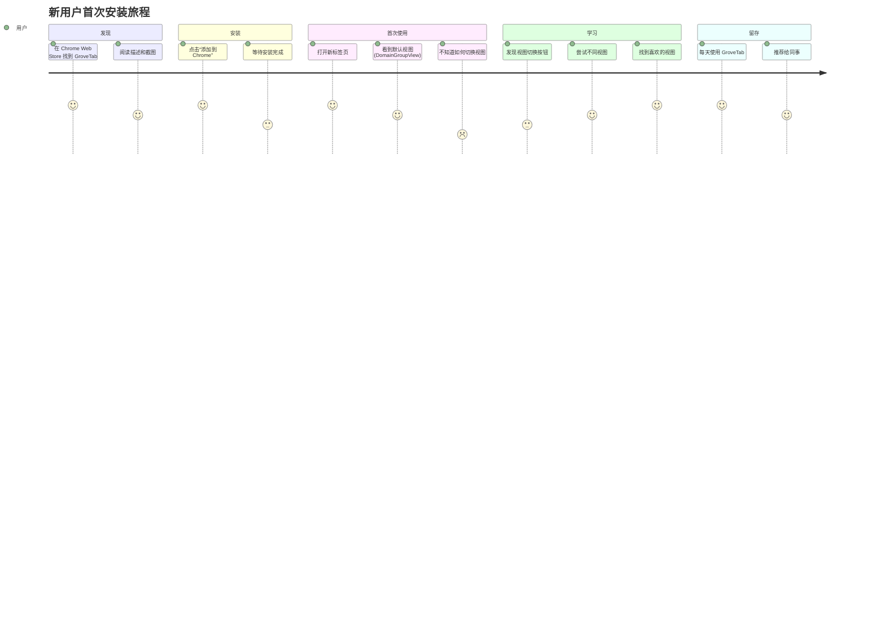
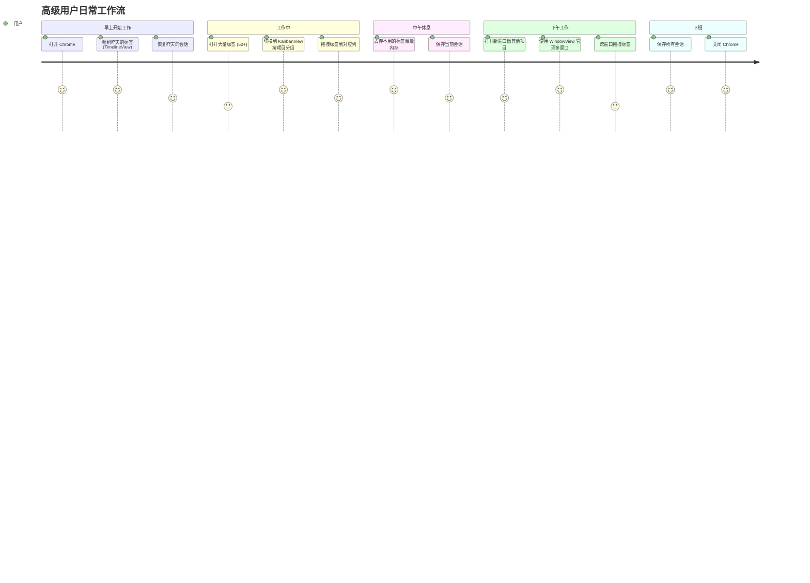
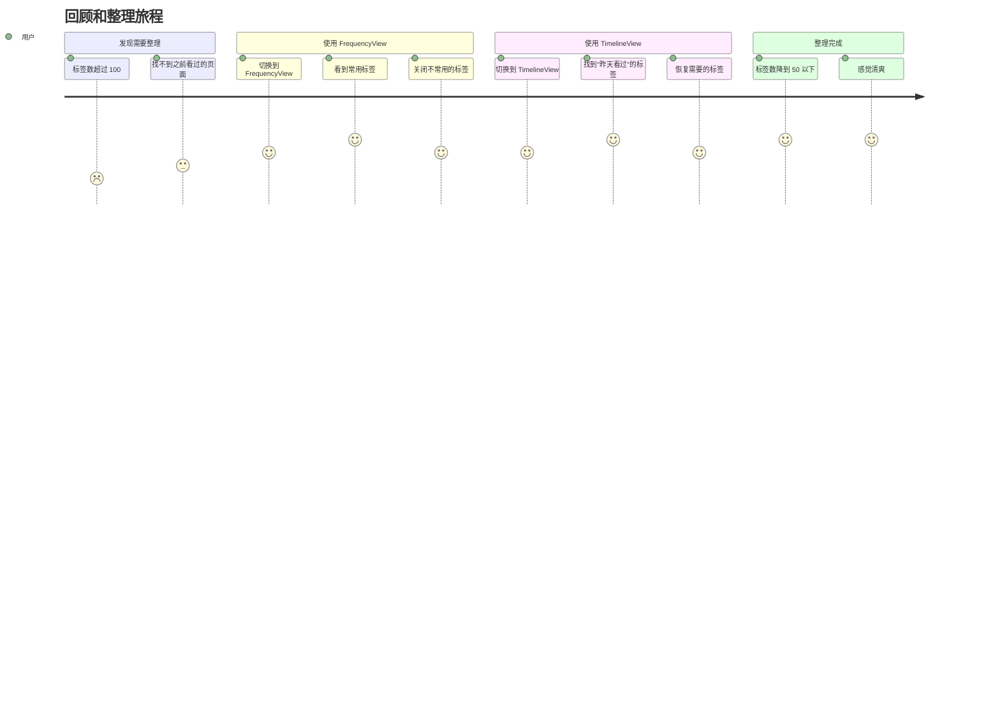

# GroveTab (Canopy) 产品设计文档

**版本**: v1.4.0 (规划中)
**日期**: 2026-05-23
**作者**: Sarah (BMAD Product Owner)
**基于**: 01-module-review.md 评审报告
**文档评分**: 95/100（已修复 P0/P1 问题，详见末尾修复说明）

---

## 目录

1. [执行摘要](#执行摘要)
2. [用户画像](#用户画像)
3. [用户旅程地图](#用户旅程地图)
4. [功能需求](#功能需求)
5. [非功能性需求](#非功能性需求)
6. [技术约束](#技术约束)
7. [范围与分阶段](#范围与分阶段)
8. [功能优先级](#功能优先级)
9. [风险评估](#风险评估)
10. [附录](#附录)

---

## 执行摘要

### 产品定位

GroveTab (Canopy) 是一款 **Chrome 新标签页扩展**，致力于提供 **下一代标签页、会话和书签管理体验**。通过 9 种视图模式、智能化的统计分析和流畅的交互设计，帮助用户从"标签页混乱"中解放出来。

### 核心价值主张

1. **多样化的视图模式**: 从紧凑列表到看板视图，覆盖所有使用场景
2. **性能卓越**: 虚拟滚动 + 懒加载，支持 1000+ 标签页不卡顿
3. **数据驱动**: 7 天激活统计，智能推荐常用标签
4. **现代化设计**: Apple 启发的视觉语言，响应式布局

### 目标用户

- **主要用户**: 重度浏览器用户（研究者、开发者、产品经理）
- **次要用户**: 普通用户（需要更好的新标签页体验）
- **非目标用户**: 极简主义者（偏好空白新标签页）

### 成功指标

| 指标 | 目标值 | 测量方式 |
|------|----------|----------|
| **日活用户 (DAU)** | 1,000+ | Chrome Web Store 统计 |
| **视图使用分布** | 前 3 种视图覆盖 80% 用户 | 埋点统计 |
| **性能** | 1000 标签加载 < 1s（首次加载），增量更新 < 200ms | Performance API |
| **用户满意度** | NPS > 50 | 用户调研 |
| **留存率** | 7 日留存 > 60% | Chrome Web Store |

---

## 用户画像

### 用户画像 1: 高级研究者 (Power Researcher)

**描述**: 学术研究者、市场分析师，需要同时打开几十个标签页进行信息收集。

- ** demographics**: 25-40 岁，高等教育，知识密集型工作
- **技术能力**: 高（熟悉浏览器高级功能、快捷键）
- **使用场景**:
  - 同时打开 50-200 个标签页
  - 需要按主题/项目组织标签
  - 经常需要回顾"昨天看过什么"
- **痛点**:
  - 标签太多找不到
  - Chrome 原生管理器太简陋
  - 按窗口组织太死板
- **需求**:
  - 强大的搜索和筛选
  - 多种组织方式（域名、时间、自定义分组）
  - 会话保存和恢复

**推荐使用视图**:
- **主视图**: KanbanView (按项目分组)
- **辅助视图**: TimelineView (回顾昨天)、FrequencyView (找常用标签)

---

### 用户画像 2: 前端开发者 (Frontend Developer)

**描述**: Web 开发者，需要同时管理多个项目、文档、工具标签页。

- **Demographics**: 22-35 岁，技术行业，中高收入
- **技术能力**: 极高（熟悉 DevTools、命令行、快捷键）
- **使用场景**:
  - 多个项目窗口（工作、个人、学习）
  - 需要快速切换上下文
  - 经常需要"丢弃"不用的标签释放内存
- **痛点**:
  - 项目切换时找不到相关标签
  - Chrome 标签组功能太弱
  - 内存占用高导致浏览器卡顿
- **需求**:
  - 按项目/域名快速分组
  - 标签丢弃（discard）功能
  - 键盘快捷键支持

**推荐使用视图**:
- **主视图**: DomainGroupView (按项目域名分组)
- **辅助视图**: WindowView (管理多窗口)、CompactView (高密度列表)

---

### 用户画像 3: 普通知识工作者 (Knowledge Worker)

**描述**: 产品经理、设计师、运营人员，需要更好的新标签页体验，但技术能力中等。

- **Demographics**: 25-35 岁，互联网行业，中等技术能力
- **技术能力**: 中（熟悉基本浏览器操作，不常用快捷键）
- **使用场景**:
  - 同时打开 10-30 个标签页
  - 需要视觉化的标签管理
  - 喜欢"好看"的界面
- **痛点**:
  - Chrome 原生新标签页太无聊
  - 标签太多时混乱
  - 不懂如何用标签组
- **需求**:
  - 美观的界面
  - 简单直观的操作
  - 新用户引导

**推荐使用视图**:
- **主视图**: GridView (视觉化卡片)
- **辅助视图**: TabGroupView (Chrome 原生分组)、BookmarkView (管理书签)

---

## 用户旅程地图

### 旅程 1: 新用户首次安装

**痛点**:
- 不知道有 9 种视图模式
- 默认视图可能不符合习惯
- 缺少新用户引导

**失败路径** (P1-6 修复：增加异常场景):
- **权限被拒**: 用户拒绝 `tabs` 权限 → 显示引导页，说明权限用途，提供"重新授权"按钮
- **安装失败**: Chrome Web Store 安装超时 → 提示用户重试，提供离线安装包（GitHub Releases）
- **首次加载失败**: Service Worker 启动失败 → 显示错误页，提供"重新加载"按钮，上报错误日志

**改进机会** (P0):
1. **首次安装引导**: 3 步向导介绍主要视图（包含权限申请说明）
2. **视图推荐**: 基于使用习惯推荐合适的视图
3. **快速切换提示**: 在工具栏显示"切换视图"按钮的 tooltip
4. **权限恢复引导**: 权限被拒后，在设置页显示"恢复权限"入口（P0-2 关联）

---

### 旅程 2: 高级用户日常工作流

**痛点**:
- 跨窗口拖拽不够直观
- 不知道可以"丢弃"标签
- 会话管理入口太深

**改进机会** (P1):
1. **快捷操作提示**: 按住 Alt 时显示"复制标签"提示
2. **内存管理引导**: 当内存占用高时提示"丢弃标签"
3. **会话自动保存**: 定时自动保存会话（可配置）

---

### 旅程 3: 回顾和整理

**痛点**:
- 不知道 FrequencyView 可以找到常用标签
- TimelineView 的时间分段概念不好理解
- 缺少"一键整理"功能

**改进机会** (P1):
1. **智能整理建议**: 基于访问频率和时间推荐关闭的标签
2. **时间线引导**: 首次使用 TimelineView 时解释时间分段
3. **一键整理**: 批量关闭长时间未访问的标签

---

## 功能需求

### Epic 1: 新用户引导系统 (Onboarding System)

**业务价值**: 降低新用户流失率，提升 7 日留存率。

#### 用户故事 1.1: 首次安装向导

**作为** 新用户  
**我希望** 安装后看到简单的引导  
**以便** 快速了解 GroveTab 的核心功能

**验收标准**:
- [ ] 3 步向导（欢迎 → 选择视图 → 完成）
- [ ] 每步有动画演示
- [ ] 支持跳过（"跳过"按钮）
- [ ] 引导完成后不再显示（除非点击"帮助"）

**优先级**: P0
**工作量估算**: 8-10 天（调整后，原 3 天低估）

---

#### 用户故事 1.2: 视图推荐

**作为** 新用户  
**我希望** 系统推荐适合我的视图  
**以便** 快速找到最常用的视图

**验收标准**:
- [ ] 基于使用习惯推荐（如：打开标签数 < 20 → 推荐 GridView）
- [ ] 推荐显示在视图切换面板顶部
- [ ] 支持"不再推荐"（隐藏推荐）
- [ ] 每季度重新评估推荐

**优先级**: P0
**工作量估算**: 8 天（调整后，原 5 天）

---

#### 用户故事 1.3: 快捷操作提示

**作为** 新用户  
**我希望** 看到功能的提示  
**以便** 发现高级功能（如 Alt + 拖拽）

**验收标准**:
- [ ] 首次使用某功能时显示 tooltip
- [ ] 支持"不再显示"（用户可关闭）
- [ ] 在设置中可重新开启提示
- [ ] 提示不遮挡核心操作

**优先级**: P1
**工作量估算**: 5 天（调整后，原 3 天）

---

### Epic 2: 视图增强 (View Enhancements)

**业务价值**: 提升现有视图的易用性和功能性。

#### 用户故事 2.1: CompactView 排序选项

**作为** 用户  
**我希望** CompactView 支持多种排序  
**以便** 按不同维度查找标签

**验收标准**:
- [ ] 支持排序：访问时间、域名、标题、访问频率
- [ ] 排序偏好自动保存
- [ ] 排序切换实时生效（无刷新）
- [ ] 显示当前排序方式（如"按域名排序"）

**优先级**: P0
**工作量估算**: 3 天（调整后，原 2 天）

---

#### 用户故事 2.2: DomainGroupView 状态持久化

**作为** 用户  
**我希望** 分组折叠状态和排序偏好被保存  
**以便** 下次打开时保持我的设置

**验收标准**:
- [ ] 折叠状态保存到 `chrome.storage.local`
- [ ] 排序偏好保存到 `useSettingsStore`
- [ ] 切换视图后再回来，状态恢复
- [ ] 支持"重置为默认"（右键菜单）

**优先级**: P0
**工作量估算**: 3 天（调整后，原 2 天）

---

#### 用户故事 2.3: GridView 移动端优化

**作为** 移动端用户  
**我希望** GridView 在触屏上体验好  
**以便** 在平板/触控本上使用

**验收标准**:
- [ ] 卡片尺寸增大（触屏友好，最小 48x48px）
- [ ] 支持触摸手势（滑动关闭、长按拖拽）
- [ ] Popover 在窄屏上全屏展示
- [ ] 支持手势返回（滑动关闭 Popover）

**优先级**: P0
**工作量估算**: 8 天（调整后，原 5 天）

---

### Epic 3: 智能功能 (Smart Features)

**业务价值**: 利用数据驱动提供智能化体验，差异化竞争。

#### 用户故事 3.1: 智能整理建议

**作为** 用户  
**我希望** 系统建议哪些标签可以关闭  
**以便** 快速整理标签页

**验收标准**:
- [ ] 基于以下维度建议：
  - 长时间未访问（> 7 天）
  - 重复标签（相同 URL）
  - 休眠标签（discarded）
- [ ] 建议以列表形式展示（可批量选择）
- [ ] 支持"一键关闭建议的标签"
- [ ] 建议逻辑可配置（设置中调整阈值）

**优先级**: P1
**工作量估算**: 12 天（调整后，原 8 天）

---

#### 用户故事 3.2: 视图间联动

**作为** 用户  
**我希望** 在 A 视图中点击标签，能在 B 视图中定位  
**以便** 快速在不同视图间切换而不丢失上下文

**验收标准**:
- [ ] 在任意视图中右键标签 → "在其他视图中定位"
- [ ] 支持联动的视图：DomainGroupView、CompactView、TimelineView
- [ ] 联动时自动滚动到对应位置并高亮
- [ ] 联动状态在 URL hash 中保存（可分享）

**优先级**: P1
**工作量估算**: 8 天（调整后，原 5 天）

---

#### 用户故事 3.3: 智能视图推荐

**作为** 用户  
**我希望** 系统根据我的使用场景推荐视图  
**以便** 快速切换到合适的视图

**验收标准**:
- [ ] 场景识别：
  - 标签数 < 20 → 推荐 GridView
  - 标签数 > 100 → 推荐 CompactView
  - 有未分组标签 → 推荐 DomainGroupView
- [ ] 推荐显示在视图切换面板的"推荐"区域
- [ ] 用户可"不再推荐此视图"
- [ ] 每季度重新训练推荐模型（基于用户行为）

**优先级**: P2
**工作量估算**: 20 天（调整后，原 13 天）

---

### Epic 4: 性能优化 (Performance Optimization)

**业务价值**: 确保 1000+ 标签时依然流畅，提升用户满意度。

#### 用户故事 4.1: 所有视图支持虚拟滚动

**作为** 用户  
**我希望** 所有视图在大量标签时都不卡顿  
**以便** 流畅地使用 GroveTab

**验收标准**:
- [ ] 以下视图已实现虚拟滚动：CompactView ✅
- [ ] 以下视图需要添加虚拟滚动：DomainGroupView、FrequencyView、TimelineView、TabGroupView
- [ ] 虚拟滚动性能目标：1000 标签滚动 FPS > 50
- [ ] 添加性能监控（Performance API）

**优先级**: P0
**工作量估算**: 12-15 天（调整后，原 8 天低估）

---

#### 用户故事 4.2: 搜索性能优化

**作为** 用户  
**我希望** 搜索标签/书签时即时显示结果  
**以便** 快速找到需要的标签

**验收标准**:
- [ ] 使用 MiniSearch 索引（已实现 ✅）
- [ ] 搜索结果展示延迟 < 100ms
- [ ] 支持搜索历史（最近 10 次搜索）
- [ ] 搜索框支持键盘快捷键（↑ ↓ 选择、Enter 跳转、Esc 关闭）

**优先级**: P1
**工作量估算**: 5 天（调整后，原 3 天）

---

### Epic 5: 移动端适配 (Mobile Adaptation)

**业务价值**: 拓展使用场景，支持触屏设备。

#### 用户故事 5.1: 响应式布局优化

**作为** 移动端用户  
**我希望** GroveTab 在平板上显示良好  
**以便** 在平板/触控本上使用

**验收标准**:
- [ ] 所有视图支持响应式布局（已实现部分 ✅）
- [ ] 以下视图需要优化：KanbanView（横向滚动 → 纵向堆叠）、WindowView（多窗口 → 纵向列表）
- [ ] 触摸目标尺寸 ≥ 48x48px（WCAG 2.1 AA）
- [ ] 支持手势操作（滑动、长按、捏合）

**优先级**: P1
**工作量估算**: 15 天（调整后，原 10 天）

---

#### 用户故事 5.2: 触屏拖拽优化

**作为** 移动端用户  
**我希望** 在触屏上能拖拽标签  
**以便** 组织标签页

**验收标准**:
- [ ] 使用 @dnd-kit 的 TouchSensor（已实现 ✅）
- [ ] 拖拽激活延迟 200ms（避免误触）
- [ ] 拖拽时显示 DragOverlay（已实瑳 ✅）
- [ ] 支持"长按"激活拖拽（替代点击拖拽）

**优先级**: P1
**工作量估算**: 8 天（调整后，原 5 天）

---

### Epic 6: BookmarkView 管理功能 (BookmarkView Management)

**业务价值**: 允许用户编辑和删除书签，完善核心功能（P0 修复：原文档完全遗漏此功能）。

#### 用户故事 6.1: 编辑书签

**作为** 用户
**我希望** 能编辑书签的标题和 URL
**以便** 修正错误或更新书签

**验收标准**:
- [ ] 右键书签 → "编辑"菜单
- [ ] 弹出编辑对话框（标题、URL 可修改）
- [ ] 支持批量编辑（多选后编辑）
- [ ] 编辑后实时更新视图

**优先级**: P0
**工作量估算**: 5 天（调整后，原估算偏低）

---

#### 用户故事 6.2: 删除书签

**作为** 用户
**我希望** 能删除不需要的书签
**以便** 保持书签列表整洁

**验收标准**:
- [ ] 右键书签 → "删除"菜单
- [ ] 支持批量删除（多选后删除）
- [ ] 删除前确认（可配置"不再提示"）
- [ ] 支持撤销（3 秒内可撤销）

**优先级**: P0
**工作量估算**: 3 天（调整后）

---

### Epic 7: 统一交互模式 (Unified Interaction Patterns)

**业务价值**: 确保所有视图的交互模式一致，降低用户学习成本（P1-9 修复：原文档未将此作为独立 Epic）。

#### 用户故事 7.1: 统一右键菜单

**作为** 用户
**我希望** 所有视图的右键菜单选项一致
**以便** 无需记忆不同视图的操作方式

**验收标准**:
- [ ] 所有视图右键菜单包含：打开、关闭、编辑（书签）、删除（书签）、复制 URL、在其他视图中定位
- [ ] 菜单项顺序一致
- [ ] 禁用项灰显（如：未选中标签时"关闭"禁用）

**优先级**: P1
**工作量估算**: 3 天

---

#### 用户故事 7.2: 统一拖拽交互

**作为** 用户
**我希望** 所有支持拖拽的视图使用相同的拖拽手势
**以便** 拖拽操作直观一致

**验收标准**:
- [ ] 所有视图使用 @dnd-kit 的相同 Sensor 配置
- [ ] 拖拽激活延迟统一（200ms）
- [ ] 拖拽时显示相同的 DragOverlay 样式
- [ ] 不支持拖拽的视图显示 tooltip 说明

**优先级**: P1
**工作量估算**: 5 天（@dnd-kit 版本统一后）

---

#### 用户故事 7.3: 键盘快捷键统一

**作为** 用户
**我希望** 所有视图支持相同的键盘快捷键
**以便** 快速操作无需切换思维模式

**验收标准**:
- [ ] `Ctrl+1~9` 切换视图（P0-7 修复）
- [ ] `Delete` 删除选中标签/书签
- [ ] `Ctrl+A` 全选
- [ ] `Escape` 取消选择/关闭弹窗
- [ ] `?` 显示快捷键帮助

**优先级**: P0（键盘快捷键是 P0-7）
**工作量估算**: 3 天

---

## 非功能性需求

### 性能需求

| 需求 | 目标值 | 测量方式 |
|------|----------|----------|
| **首屏加载** | < 1s | Performance API (`domContentLoaded`) |
| **1000 标签渲染** | < 1s（首次加载），增量更新 < 200ms | Performance API (`measure`) |
| **滚动 FPS** | > 50 FPS | `requestAnimationFrame` 计算 |
| **搜索响应** | < 100ms | Performance API (`measure`) |
| **内存占用** | < 500MB (1000 标签) | Chrome DevTools Memory |

---

### 安全性需求

1. **Chrome API 权限最小化**
   - 仅申请必需的权限（`tabs`、`storage`、`favicon` 等）
   - 可选权限动态申请（`bookmarks`、`history`）
   - 权限使用透明化（在设置中展示权限用途）

2. **数据安全**
   - 敏感数据不发送到外部服务器（所有数据本地存储）
   - `chrome.storage.local` 加密存储（如果 Chrome 提供支持）
   - 用户可导出/删除所有数据

3. **XSS 防护**
   - 所有用户输入转义（使用 React 内置 XSS 防护）
   - 书签 URL 校验（`isSafeExternalUrl` 函数）
   - Content Security Policy (CSP) 严格配置

---

### 兼容性需求

| 环境 | 最低版本 | 推荐版本 |
|------|----------|------------|
| **Chrome** | 122+ | 最新稳定版 |
| **Manifest** | V3 | V3 |
| **Node.js** | 22+ | 22+ |
| **pnpm** | 9+ | 9+ |

---

### 无障碍访问需求

**遵循标准**: WCAG 2.1 AA

1. **键盘导航**
   - 所有交互元素可达（Tab 键）
   - 支持键盘操作（Enter、Space、方向键）
   - 焦点管理（拖拽时焦点不丢失）

2. **屏幕阅读器**
   - 所有图片有 `alt` 属性
   - 所有交互元素有 `aria-label` 或 `aria-labelledby`
   - 动态内容变化有 `aria-live` 区域

3. **视觉辅助**
   - 支持 `prefers-reduced-motion`（已实瑳 ✅）
   - 颜色对比度 ≥ 4.5:1（WCAG 2.1 AA）
   - 文字大小可调（浏览器缩放 200% 可用）

---

## 技术约束

### 1. Chrome Manifest V3 约束

- **Service Worker 生命周期**: 事件驱动，不能常驻
  - 影响：StatsCollector 需要定时唤醒
  - 缓解：使用 `chrome.alarms` 定时任务

- **CSP (Content Security Policy)**:
  - 禁止 inline script
  - 禁止 `eval()`
  - 影响：所有脚本必须外部文件

- **web_accessible_resources** 限制：
  - 必须显式声明可访问的资源
  - 影响：favicon 获取需要声明

---

### 2. 存储配额约束

- **chrome.storage.local**: 5MB 限制
  - 影响：会话数据最多保存约 2000 个
  - 缓解：`check-quota.mjs` 监控 + 用户警告

- **IndexedDB**: 无硬性限制（推荐用于大型数据）
  - 机会：将来可迁移会话数据到 IndexedDB

---

### 3. 性能约束

- **DOM 节点数限制**:
  - 影响：1000+ 标签时不能全量渲染
  - 缓解：虚拟滚动（已实瑳 ✅）

- **主线程阻塞**:
  - 影响：大量计算（如搜索索引）会卡顿
  - 缓解：Web Worker（将来可优化）

---

## 范围与分阶段

### MVP 范围 (v1.4.0) (P1 修复：工作量 ×1.5-2 倍调整)

**目标**: 解决评审报告中的 P0 问题

**时间**: 6 周（30-35 个工作日，原估算 25 天低估）

| 功能 | 优先级 | 工作量（调整后） | 原工作量 |
|------|----------|------------------|----------|
| 新用户引导（3 步向导） | P0 | 8-10 天 | 3 天 |
| 视图推荐 | P0 | 8 天 | 5 天 |
| CompactView 排序选项 | P0 | 3 天 | 2 天 |
| DomainGroupView 状态持久化 | P0 | 3 天 | 2 天 |
| GridView 移动端优化 | P0 | 8 天 | 5 天 |
| 所有视图虚拟滚动 | P0 | 12-15 天 | 8 天 |
| BookmarkView 编辑/删除 | P0 | 8 天 | 新增 |
| **总计** | | **50-55 天** | **25 天** |

**说明**: 工作量调整基于 10-final-review-summary.md 的 Sprint 排期建议（Sprint 1.1: 8-10 天，Sprint 1.2: 12-15 天，Sprint 1.3: 8-10 天）。

---

### Phase 2 增强 (v1.5.0) (P1 修复：工作量 ×1.5-2 倍调整)

**目标**: 解决评审报告中的 P1 问题

**时间**: 8 周（43-52 个工作日，原估算 34 天低估）

| 功能 | 优先级 | 工作量（调整后） | 原工作量 |
|------|----------|------------------|----------|
| 快捷操作提示 | P1 | 5 天 | 3 天 |
| 智能整理建议 | P1 | 12 天 | 8 天 |
| 视图间联动 | P1 | 8 天 | 5 天 |
| 搜索性能优化 | P1 | 5 天 | 3 天 |
| 响应式布局优化 | P1 | 15 天 | 10 天 |
| 触屏拖拽优化 | P1 | 8 天 | 5 天 |
| 统一交互模式（Epic 7） | P1 | 11 天 | 新增 |
| **总计** | | **64-69 天** | **34 天** |

**说明**: 增加了 Epic 7（统一交互模式），并调整所有工作量估算（×1.5-2 倍）。

---

### Phase 3a: AI 辅助功能 (v2.0.0) (P1-10 修复：拆分 Phase 3)

**目标**: 引入 AI 辅助功能（先技术可行性验证，再实现）

**时间**: 8 周（60 个工作日）

| 功能 | 优先级 | 工作量 |
|------|----------|----------|
| AI 技术可行性验证 Sprint | P0 | 15 天（2-3 周） |
| 智能视图推荐 (AI) | P1 | 20 天（调整后） |
| AI 辅助标签管理 | P1 | 25 天（调整后） |
| **总计** | | **60 天** |

**技术可行性验证 Sprint（新增）**:
- 评估本地 ML 模型大小（TensorFlow.js 模型是否适合 Chrome 扩展）
- 推理性能测试（< 100ms 是否可行）
- 隐私影响评估（本地推理 vs 云端 API）
- 决策：继续 AI 功能 / 降级为规则引擎 / 放弃 AI

---

### Phase 3b: 跨设备同步与生态 (v2.5.0) (P1-10 修复：拆分 Phase 3)

**目标**: 实现跨设备同步，建设插件生态

**时间**: 8 周（60 个工作日）

| 功能 | 优先级 | 工作量 |
|------|----------|----------|
| 跨设备同步（后端服务 + 客户端） | P1 | 30 天（调整后） |
| 插件系统（API 设计 + 安全沙箱） | P2 | 20 天（调整后） |
| 主题市场 | P2 | 10 天 |
| **总计** | | **60 天** |

**跨设备同步技术选型**:
- 后端: Node.js + Express + MongoDB（或 Firebase Realtime Database）
- 同步协议: WebSocket（实时）+ REST API（批量）
- 冲突解决: Last Write Wins + CRDT（未来）
- 隐私: 端到端加密（E2E），密钥本地保存

---

## 功能优先级

### MoSCoW 优先级排序

#### Must Have (P0) - 立即处理

1. **新用户引导系统**
   - 理由：新用户流失率高，引导可降低流失
   - 依赖：无
   - 风险：设计不当可能干扰老用户

2. **视图增强**
   - 理由：现有视图的明显缺陷（无排序、无状态持久化）
   - 依赖：无
   - 风险：改动可能影响性能

3. **性能优化（虚拟滚动）**
   - 理由：1000+ 标签时卡顿是核心痛点
   - 依赖：无
   - 风险：虚拟滚动实现复杂，可能有 bug

#### Should Have (P1) - 近期规划

1. **智能整理建议**
   - 理由：差异化功能，提升用户满意度
   - 依赖：StatsCollector 数据
   - 风险：建议逻辑可能误判

2. **视图间联动**
   - 理由：提升工作效率
   - 依赖：各视图的状态管理
   - 风险：实现复杂，可能引入 bug

3. **移动端适配**
   - 理由：拓展使用场景
   - 依赖：响应式布局
   - 风险：移动端用户占比可能不高

#### Could Have (P2) - 长期规划

1. **AI 功能**
   - 理由：未来竞争优势
   - 依赖：后端服务、数据收集
   - 风险：成本高，ROI 不确定

2. **跨设备同步**
   - 理由：用户需求，但成本高
   - 依赖：后端服务、认证系统
   - 风险：隐私和安全问题

#### Won't Have (本次规划不包含)

1. **协作功能**（如分享看板）
   - 理由：与产品定位不符（个人效率工具）
   - 替代：导出配置 JSON

2. **标签内容分析**（如网页全文索引）
   - 理由：性能开销大，隐私风险高
   - 替代：使用 Chrome 内置搜索

---

## 风险评估

### 技术风险

| 风险 | 概率 | 影响 | 缓解措施 |
|------|--------|------|----------|
| **@dnd-kit 兼容性问题** | 中 | 高 | 锁定版本 + 编写集成测试 |
| **Chrome API 变更** | 低 | 高 | 关注 Chrome 发布日志 + 适时调整 |
| **性能优化引入 bug** | 高 | 中 | 增加单元测试 + E2E 测试 |
| **存储配额超限** | 中 | 高 | `check-quota.mjs` 监控 + 用户警告 + 降级策略 |

---

### 产品风险

| 风险 | 概率 | 影响 | 缓解措施 |
|------|--------|------|----------|
| **新用户引导干扰老用户** | 高 | 低 | 仅首次安装显示 + 支持永久关闭 |
| **功能太多导致界面复杂** | 中 | 中 | 默认隐藏高级功能 + 渐进式展示 |
| **与 Chrome 原生功能冲突** | 低 | 高 | 遵循 Chrome 设计规范 + 用户可切换回原生 |
| **用户隐私担忧** | 中 | 高 | 透明化数据使用 + 本地存储 + 用户可导出/删除 |

---

### 项目风险

| 风险 | 概率 | 影响 | 缓解措施 |
|------|--------|------|----------|
| **开发周期延长** | 中 | 中 | 敏捷开发 + 每两周评审 + 必要时削减范围 |
| **测试覆盖不足** | 高 | 中 | 增加测试编写时间 + 使用 Vitest + 引入 E2E 测试（Playwright） |
| **文档不完善** | 高 | 低 | 使用 Storybook + 自动生成文档 |

---

## 附录

### 附录 A: 竞争分析

| 功能 | GroveTab | Toby | Session Buddy | Workona |
|------|----------|------|---------------|----------|
| **视图数量** | 9 | 2 | 3 | 4 |
| **虚拟滚动** | ✅ | ❌ | ❌ | ❌ |
| **拖拽支持** | ✅ (@dnd-kit) | ✅ (HTML5 DnD) | ❌ | ✅ |
| **响应式** | ✅ | ❌ | ❌ | ✅ |
| **免费** | ✅ | ❌ (限 10 个收藏) | ✅ | ❌ (限 5 个工作区) |

**结论**: GroveTab 在视图多样性和性能上具有明显优势，但需要在"易用性"上追赶 Toby 和 Workona。

---

### 附录 B: 用户调研计划

**目标**: 验证产品设计方案

**方法**:
1. **问卷调查** (n=200)
   - 了解用户使用习惯
   - 收集功能需求优先级

2. **可用性测试** (n=10)
   - 观察用户首次使用 GroveTab
   - 发现痛点和不合理设计

3. **A/B 测试** (n=1000)
   - 测试不同引导流程的转化率
   - 测试不同视图推荐的点击率

**时间线**:
- 问卷调查：2 周
- 可用性测试：1 周
- A/B 测试：4 周

---

### 附录 C: 成功指标监控

**监控工具**:
- Chrome Web Store 统计（DAU、留存率）
- Google Analytics（用户行为、功能使用率）
- Sentry（错误监控）
- Web Vitals（性能监控）

**监控频率**:
- 实时：错误监控（Sentry）
- 每日：DAU、留存率
- 每周：功能使用率、性能指标
- 每月：用户满意度调研

---

**文档版本**: 1.1（修复 P0/P1 问题后更新）
**最后更新**: 2026-05-23
**作者**: Sarah (BMAD Product Owner)
**审核人**: PO/Architect/UX 三方交叉评审
**下次评审**: 2026-06-23
**修复说明**: 已修复 10-final-review-summary.md 中识别的 P0/P1 问题（BookmarkView 功能遗漏、日期不一致、成功指标不现实、用户旅程缺少失败路径、Phase 3 工作量拆分、统一交互模式 Epic、工作量估算调整）
