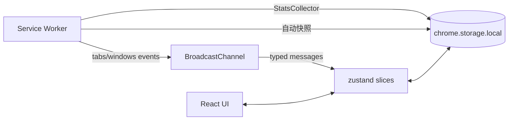

# Canopy 架构（ARCHITECTURE）

## 目录总览

```
src/
├── pages/
│   ├── newtab/         // 新标签页入口（App.tsx 主进程）
│   └── popup/          // Toolbar Popup（360×520 四区轻量版）
├── sw/                 // Service Worker（tab 事件广播 / StatsCollector / 自动快照闹钟 / OG 抓取）
├── features/
│   ├── dashboard/      // DashboardOverview + ActivityStrip
│   ├── sessions/       // ArchivePanel / OnboardingCard v2 / SessionItem
│   ├── tabs/           // 各种视图 + TidySuggestionBar + DuplicatePreviewModal + KanbanView
│   ├── settings/       // SettingsPanel + 各类 panel（Behavior/Appearance/Shortcuts/Data）
│   ├── search/         // SearchBox + parseQuery
│   ├── insights/       // InsightsPanel（本地隐私洞察）
│   └── workspace/      // WorkspaceSwitcher
├── services/           // archive-service 等业务服务
├── repositories/       // storage-repo（所有 chrome.storage.local 访问）
├── store/              // zustand slices（tabs / settings / metadata / undo / selection / stats / kanban）
├── shared/
│   ├── types.ts        // 跨模块类型
│   ├── i18n/           // zh-CN / en
│   ├── ui/             // UndoToast / feedback
│   ├── theme/          // gradient presets
│   ├── hooks/          // use-sw-broadcast / use-reduced-motion
│   ├── utils/          // dedupe / idle-detect / import-export / metrics / icon-colors / url-display
│   └── config/         // views / view-registry / search-engines
└── chrome/             // chrome API 薄封装
```

## 数据流



关键约定：
- **UI 只读 store，不直接调用 chrome.* API**；所有副作用通过 service / repo 层。
- **Store slices 自持 selector 稳定引用**（`Object.freeze([])`），避免 React 18/19 useSyncExternalStore 无限重渲染。
- **SW 与 UI 通过 BroadcastChannel 双向同步**；Tab 状态变化 → SW 先广播 → UI 订阅。

## Schema 版本化

- `canopy_meta.schemaVersion` 当前为 **2**。
- `ensureMeta()` 在启动时校验；发现旧版本自动调用 `runMigrations()`。
- v1 → v2 为增量物化：缺失字段走读取路径的 `withDefaults` 兜底，实际迁移脚本仅把默认值落盘到 `canopy_settings`。
- **回退安全**：新字段不参与老逻辑路径，不会因降级扩展而崩溃。

## 性能护栏

| 指标 | 限制 | 当前 |
| --- | --- | --- |
| 首屏 JS raw | ≤ 280 KB | 67.80 KB |
| 首屏 JS gz | ≤ 90 KB | 20.39 KB |
| SW raw | ≤ 60 KB | 7.72 KB |
| 主 CSS raw | ≤ 80 KB | 6.21 KB |
| FCP p75（本地埋点） | ≤ 1200 ms | 采样中 |
| FPS p50 滑动 10s | ≥ 55 | 采样中 |

- `scripts/check-quota.mjs` 在 CI 执行，违反即 exit(1)。
- manualChunks 按"vendor-\* + feat-\*"拆片，保证首屏只加载 newtab + vendor-react-dom + vendor-antd。

## 可扩展点

- **视图**：`registerViews([{ id, component, order }])`，新增视图只需实现组件并注册。
- **存储键**：扩展 `StorageKey` 联合类型 + repository helper，自动纳入 schema 版本化。
- **埋点**：`track(event, payload)` 事件流；InsightsPanel 自动聚合展示。
- **搜索语法**：`parseQuery` 支持加新前缀，只要在 switch 中追加 case。

## 测试策略

- 单测覆盖纯函数：`dedupe / idle-detect / parse-query / import-export / url-display / view-registry / keybindings / color / profiles`。
- smoke 测试：`tests/unit/smoke.test.ts` 保证基础链路可链接。
- E2E 手工对照：`QA_CHECKLIST.md` 的 B 表 23 项封板功能。

## 已知设计取舍（v1.0）

- **KanbanView 未采用 @dnd-kit**：用原生 HTML5 DnD 控制包体，交互完全满足"拖拽 + 列 + 卡片"需求；后续 v1.1 如需排序动画可再引入。
- **Workspace 深度过滤未内建**：存储与 chip UI 已具备，全局 tabs 过滤作为 v1.1 小步迭代。
- **CommandCenter 8 类型混排 UI 未重写**：parseQuery 工具层已到位，后续可渐进接入 SearchBox；当前 SearchBox 已可正常工作。
